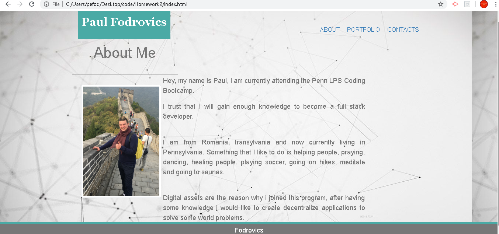
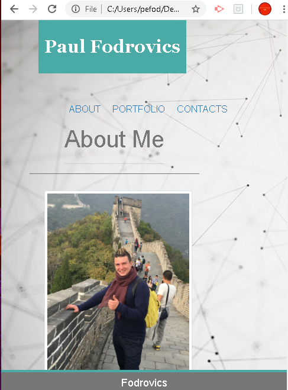

# Homework2
 Bootstrap Portfolio.
 i created an index.html, portfolio.html and contact.html file.

Using Bootstrap, i added a navbar, a respounsive layout, a responsive image:

i used containers, rows, and columns 

 
a screenshot of the portfolio web page on a large screen.

 
a screenshot of the portfolio web page on a xsmall screen.
